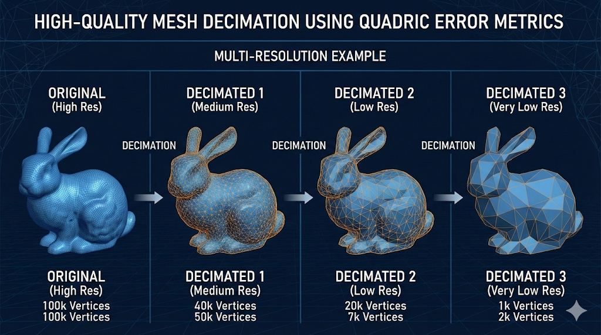
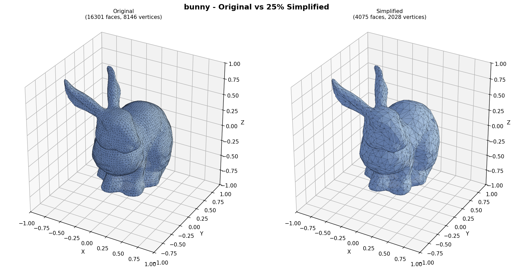
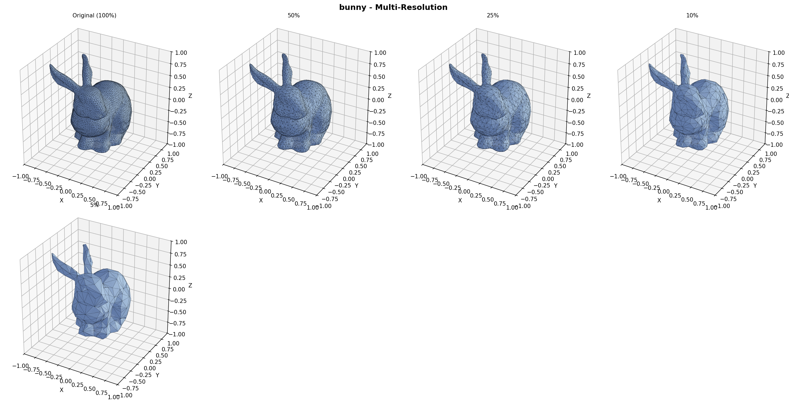
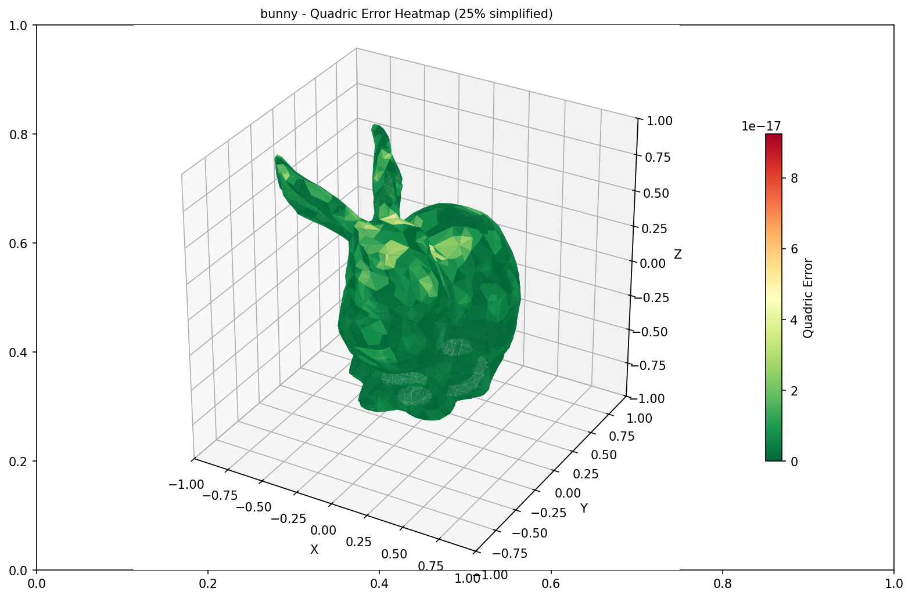
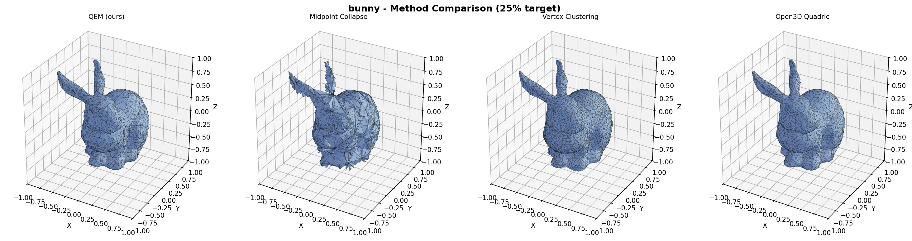
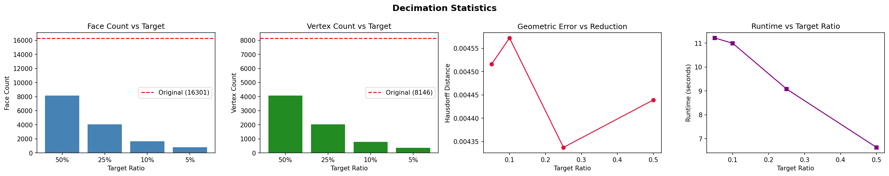

# High-Quality Mesh Decimation using Quadric Error Metrics

A Python implementation of the famous mesh simplification algorithm from **"Surface Simplification Using Quadric Error Metrics"** by Michael Garland and Paul S. Heckbert (SIGGRAPH 1997).



## Quick Start

### Installation

```bash
pip install -r requirements.txt
```

### Run the Demo

```bash
# Basic demo with generated sample mesh
python demo.py

# With a custom mesh file
python demo.py --mesh mesh.ply

# Custom reduction ratio
python demo.py --mesh mesh.ply --ratio 0.1 --boundary-weight 20.0
```

## Core Algorithm

### Quadric Error Metrics (QEM)

1. **Compute Face Planes**: For each triangle face, compute the plane equation `ax + by + cz + d = 0`

2. **Build Vertex Quadrics**: For each vertex, sum the fundamental quadrics of all incident faces:

   ```
   Q_v = Σ K_f  where K_f = p * p^T and p = [a, b, c, d]
   ```

3. **Edge Collapse Selection**: For each edge (v₁, v₂):

   - Combine quadrics: `Q = Q_v1 + Q_v2`
   - Find optimal position by minimizing: `v^T * Q * v`
   - Use priority queue to select lowest-error edge

4. **Manifold Validation**: Check link condition before collapse to maintain topology

5. **Boundary Preservation**: Add weighted perpendicular plane constraints at boundary edges

## Evaluation Metrics

### Geometric Accuracy

- **Hausdorff Distance**: Maximum distance from any point on one surface to the closest point on the other
- **Chamfer Distance**: Average of squared nearest-neighbor distances (bidirectional)
- **Volume/Area Error**: Relative change in mesh volume and surface area

### Mesh Quality

- **Face/Vertex Count**: Reduction statistics
- **Boundary Preservation**: Change in boundary edge lengths
- **Topology**: Watertight and manifold properties

## How to Test & Evaluate

### Visual Evaluation (Most Important!)

1. **Side-by-Side Comparison**

   ```python
   from src.visualization import MeshVisualizer
   visualizer = MeshVisualizer()
   visualizer.plot_mesh_comparison(original, simplified)
   ```

2. **Multi-Resolution View**

   ```python
   meshes = [original, simplified_50, simplified_25, simplified_10]
   visualizer.plot_multi_resolution(meshes)
   ```

3. **Error Heatmap**
   ```python
   visualizer.plot_error_heatmap(simplified, vertex_errors)
   ```

### Quantitative Evaluation

```python
from src.evaluation import MeshEvaluator

evaluator = MeshEvaluator()
metrics = evaluator.compute_all_metrics(original, simplified)
evaluator.print_report(metrics)
```

## Output & Visualization


### 1. Mesh Comparison 



**What it shows:** A side-by-side view of the **original mesh** (left) vs. the **simplified mesh** (right).
**Purpose:** To visually verify that the overall shape, silhouette, and volume are preserved even after removing 75% of the triangles.
**Look for:** Sharp features (like ears) remaining sharp, and smooth areas becoming "low-poly" but still recognizable.

### 2. Multi-Resolution View 


**What it shows:** Four versions of the mesh at progressive levels of simplification (e.g., 100%, 50%, 25%, 5%).
**Purpose:** To demonstrate the algorithm's stability across different levels of detail (LODs).
**Look for:** At what point does the mesh break or lose essential details? (Usually, <5% starts to look blocky).

### 3. Error Heatmap 


**What it shows:** The simplified mesh colored by **geometric error**.
- **Red:** Areas where the new surface deviates significantly from the original (high error).
- **Green/Blue:** Areas where the surface is very close to the original (low error).
**Purpose:** To diagnose *where* the simplification is losing accuracy.
**Look for:** Red spots usually appear on high-curvature areas (tips of ears, nose) that are harder to approximate with fewer triangles.

### 4. Method Comparison 


**What it shows:** The same mesh simplified to the same target ratio using **different algorithms**:
- **QEM (Ours):** High quality, feature-preserving.
- **Midpoint Collapse:** Fast but loses volume and features.
- **Vertex Clustering:** extremely fast but creates blocky, grid-like artifacts.
**Purpose:** To prove that Quadric Error Metrics provides superior visual quality compared to naiver methods.

### 5. Statistics Plot 


**What it shows:** Graphs tracking metrics as the mesh gets smaller.
- **Face Count vs Target:** Ensuring we hit the target reduction.
- **Hausdorff Distance vs Reduction:** How much error we introduce as we remove faces.
**Purpose:** A quantitative health check of the algorithm's performance.

### Recommended Test Models

- **Stanford Bunny** (~35k faces) - Classic test model
- **Armadillo** - Complex topology
- **Dragon** - High detail
- **Lucy** - Aggressive simplification test

Download from: [Stanford 3D Scanning Repository](https://graphics.stanford.edu/data/3Dscanrep/)

## 🔬 Parameter Exploration

### Boundary Weight

Controls how strongly boundaries are preserved:

| Weight | Effect                                 |
| ------ | -------------------------------------- |
| 0.0    | No boundary preservation               |
| 1.0    | Mild preservation                      |
| 10.0   | Strong preservation (default)          |
| 100.0  | Very strong (may limit simplification) |

```python
decimator = MeshDecimator(boundary_weight=10.0)
```

### Target Ratio

Specify reduction target as ratio or face count:

```python
# By ratio (keep 25% of faces)
simplified = decimator.decimate(mesh, target_ratio=0.25)

# By exact face count
simplified = decimator.decimate(mesh, target_faces=5000)
```


## References

1. Garland, M., & Heckbert, P. S. (1997). **Surface simplification using quadric error metrics**. SIGGRAPH '97.

2. Hoppe, H. (1996). **Progressive meshes**. SIGGRAPH '96.

3. Lindstrom, P., & Turk, G. (1998). **Fast and memory efficient polygonal simplification**. IEEE Visualization.

## Acknowledgments

- Stanford Computer Graphics Laboratory for test meshes
- Michael Garland and Paul Heckbert for the original QEM paper
- trimesh library for mesh I/O utilities
